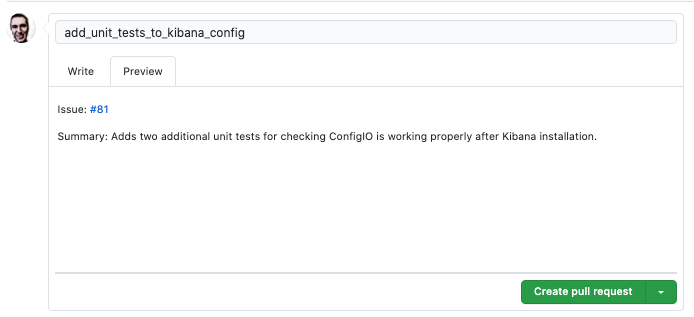

# Contributing

When contributing to this repository, please first discuss the changes you wish to make by opening an issue. 
Our team will use this issue as a primary place for tracking and communication.

## Opening an Issue

### Bugs

1. Title the issue descriptively
2. Add a `bug` label.
3. Use the following template:
  ```markdown
Description: A sentence describing the problem that is occurring. 
Expected Result: What did you expect to happen?
Steps to Reproduce:
    1. A list of steps
    2. That will reproduce the issue
    3. Be specific!

  ```

### Features and Enhancements

1. Title the issue descriptively
2. Add `feature` label if the proposed change does not exist in any form within DynamiteNSM. Use `enhancment` label if the change 
   exists, and you have a suggestion to improve it.
3. Use the following template:
```markdown
Description: Describe the enhancement or feature itself.
Purpose: What problems does it solve?
```


## Create a Pull Request

After you have created an issue and discussed your changes with a member of the team you can open a pull request.
All PRs should be made against the `develop` branch.

Pull requests should be titled simply, but descriptively. They **must** link the corresponding issue in the description.

