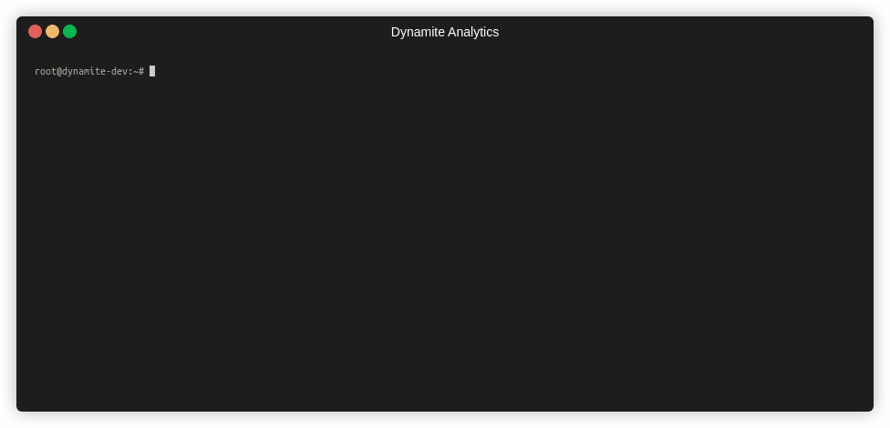
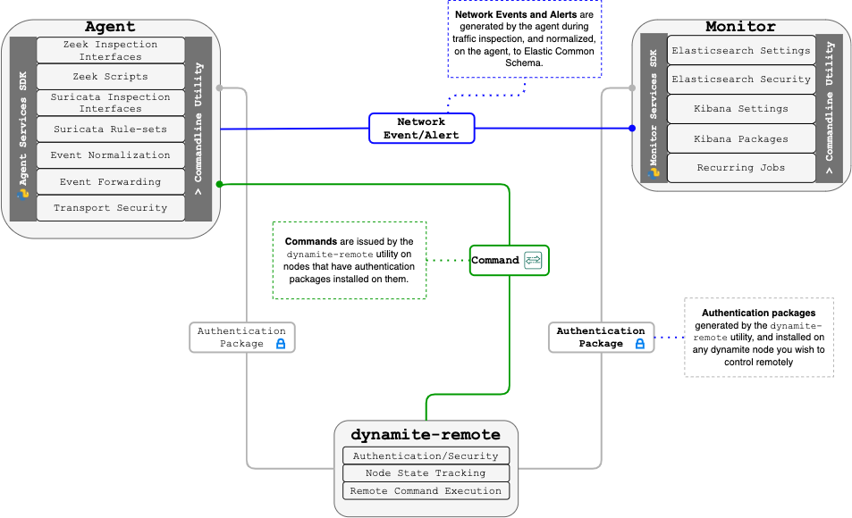

 <!-- ## *DISCOVER YOUR NETWORK* -->

<p align="center">
 <a href="http://dynamite.ai"></a>
</p>

---
[](https://github.com/DynamiteAI/dynamite-nsm/actions/workflows/zeek-installation-tests.yml) [](https://github.com/DynamiteAI/dynamite-nsm/actions/workflows/suricata-installation-tests.yml) [](https://github.com/DynamiteAI/dynamite-nsm/actions/workflows/filebeat-installation-tests.yml) [](https://github.com/DynamiteAI/dynamite-nsm/actions/workflows/elasticsearch-installation-tests.yml) [](https://github.com/DynamiteAI/dynamite-nsm/actions/workflows/logstash-installation-tests.yml) [](https://github.com/DynamiteAI/dynamite-nsm/actions/workflows/kibana-installation-tests.yml)

### What is Dynamite Network Security Monitor?

DynamiteNSM is a lightweight, versatile network security monitor conveniently bundled as a `Python 3.7+` package. It is designed to make securing your network environment simple and intuitive, and can be deployed in a environments including high-speed data centers, small-to-large enterprises, IoT & industrial networks, and even at home.

DynamiteNSM includes two key components: the agent and the monitor. The agent extracts Zeek network metadata coupled with Suricata IDS security alerts and forwards them to the monitor. The monitor processes incoming events and presents analytic information via dashboards and a powerful query interface.

DynamiteNSM can handle massive volumes of network traffic. Unlike many other tools, it can be installed and managed with a standalone command-line utility. The system is inherently passive without disruption to the network. There is no need to install agents on every computer, perform network scans, or directly interact with network assets.

**To get started. Simply install via PIP on a supported [operating system](https://dynamiteai.github.io/dynamite-nsm/requirements/01_supported_operating_systems):**

```
sudo pip3 install dynamite-nsm
```

<center>
    
</center>

### Components

<p align="center">
 </img>
</p>

### Agent
***The agent (sensor) is responsible for generating JSON events from raw network data acquired off the wire as well as parsing out relevant information, and forwarding these events to a monitor or third-party data-store.***

**To install on your sensor hardware (or VM):**
```
sudo dynamite agent install --inspect-interfaces=<iface1> <iface2> <iface3>
```


### Monitor 

***The monitor collects events/alerts generated by the agent quickly indexing them and presenting them within intuitive visualizations and powerful query interfaces.***

**To install on your monitor hardware (or VM):**
```
sudo dynamite monitor install
```

[**Quick Start Guide »**](https://dynamiteai.github.io/dynamite-nsm/guides/01_quick_start)

### Documentation

Checkout our comprehensive documentation complete with tutorials, guides, and example quickstart deployments.

Those wishing to contribute may also be interested in our [development guides](https://dynamiteai.github.io/dynamite-nsm/guides/developers/01_overview).

[**Read the Documentation »**](https://dynamiteai.github.io/dynamite-nsm/)


