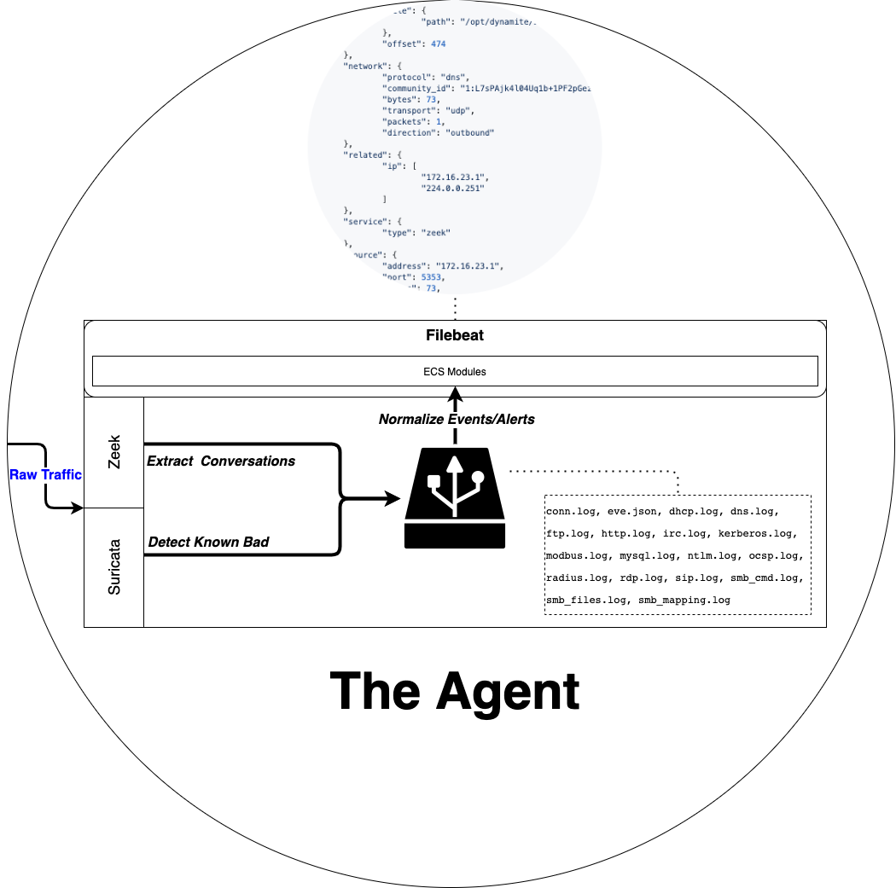
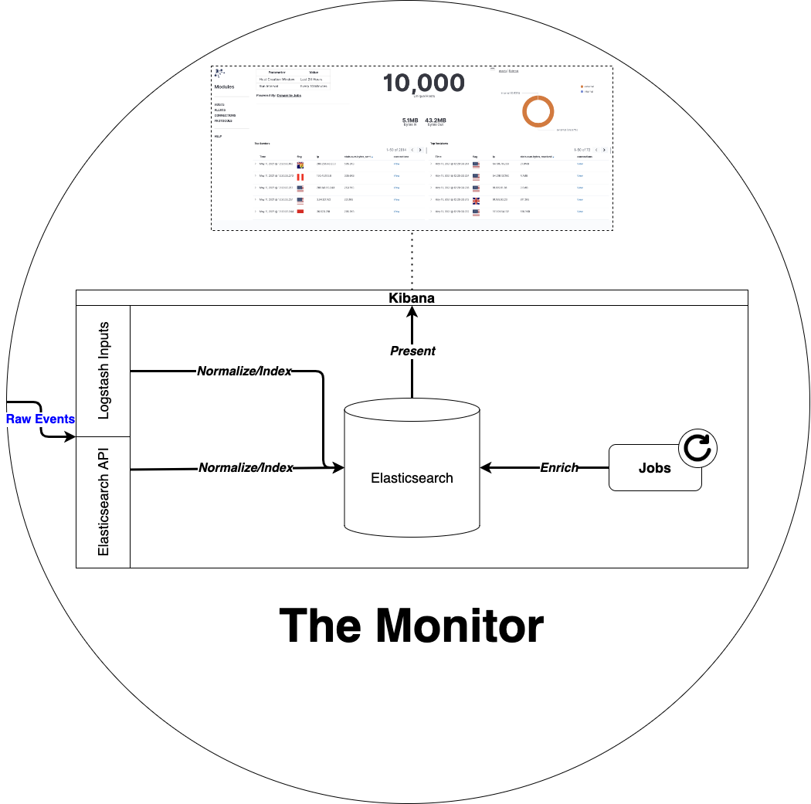

 ## *DISCOVER YOUR NETWORK*

<p align="center">
 <a href="http://dynamite.ai"></a>
</p>

### What is Dynamite Network Security Monitor?

Dynamite Network Security Monitor is a lightweight, versatile network security monitor designed to make securing your network environment simple and intuitive. With DynamiteNSM you can deploy only the sensor and monitoring components you need without having to download and install a dedicated operating system. Everything in DynamiteNSM is backed up by a well-documented SDK, providing unlimted opportunities for extension and integration.

**To get started. Simply install via PIP on a supported [operating system]():**

```
sudo pip3 install dynamite-nsm
```

### Components
<p align="center">
 </img>
</p>

***The agent (sensor) is responsible for generating JSON events from raw network data acquired off the wire as well as parsing out relevant information, and forwarding these events to a monitor or third-party data-store.***

**To install on your sensor hardware (or VM):**
```
sudo dynamite agent install --inspect-interfaces=<iface1> <iface2> <iface3>
```

[**More Info »**](https://dynamiteai.github.io/dynamite-nsm/installation/01_overview)

<p align="center">
 </img>
</p>

***The monitor collects events/alerts generated by the agent quickly indexing them and presenting them within intuitive visualizations and powerful query interfaces.***

**To install on your monitor hardware (or VM):**
```
sudo dynamite monitor install
```

### Documentation

Checkout our comprehensive documentation complete with tutorials, guides, and example and quickstart deployments.

Those wishing to contribute may also be interested in our [development guides](https://dynamite-nsm.readthedocs.io/en/latest/developers/01_overview).

[**Read the docs »**](https://dynamiteai.github.io/dynamite-nsm/)


