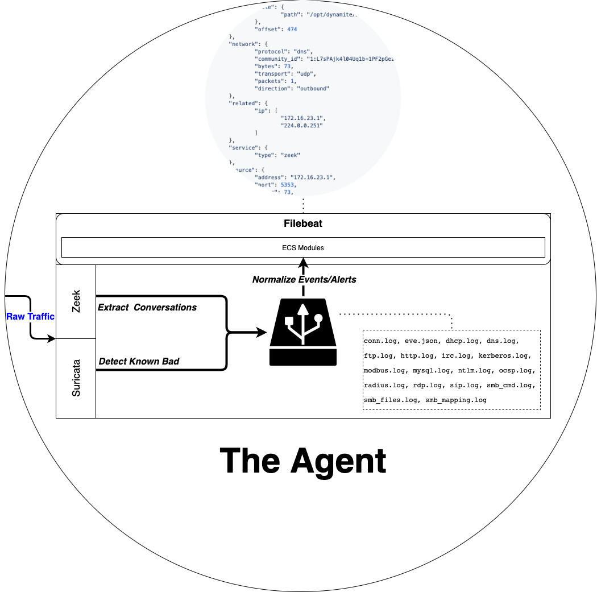

# General Architecture

Within DynamiteNSM a `service` is a collection of wrappers around a utility that provide the ability to perform actions like:

- installation
- configuration
- process management
- performance monitoring
- troubleshooting

DynamiteNSM ships with two main groups of services: the agent and the monitor.
### Agent Services

The agent (sensor) is responsible for generating JSON events from raw network packets and forwarding these events to a monitor. 

| Service   | Description                                                                                                                                                                                                                                                      |
|-------------|------------------------------------------------------------------------------------------------------------------------------------------------------------------------------------------------------------------------------------------------------------------|
| [Zeek [3.0.3]](https://github.com/zeek/zeek)           | Previously Bro, Zeek is a powerful network analysis framework that is differs from your typical IDS. It is capable of enumerating detailed information surrounding network connections and their underlying protocols.|
| [Suricata [4.1.4]](https://github.com/OISF/suricata)   | Suricata is an Intrusion Detection System (IDS), powered by the latest open [EmergingThreat](https://doc.emergingthreats.net/) rule-sets.
| [Filebeat-OSS [7.2.1]](https://github.com/elastic/beats)   | A powerful log forwarder, with a built in queue mechanisms, and a pressure sensitive protocol that works in conjunction with LogStash.                                                                                |

### Monitor Services

The monitor is responsible for collecting these events, enriching and normalizing them, and presenting them to the end-user through intuitive visualizations and a powerful search user interface

| Service                                                | Description                                                                                                                     |
|--------------------------------------------------------|---------------------------------------------------------------------------------------------------------------------------------|
| [Logstash [7.2.1]](https://github.com/elastic/logstash)            | A server-side data processing pipeline that ingests data from a multitude of sources simultaneously, transforms it. |
| [Elasticsearch [7.2.0]](https://github.com/elastic/elasticsearch)  | A distributed, RESTful search and analytics engine.                                                                 |
| [Kibana [7.2.0]](https://github.com/elastic/kibana)                | A web-app that allows you to visualize your Elasticsearch data     