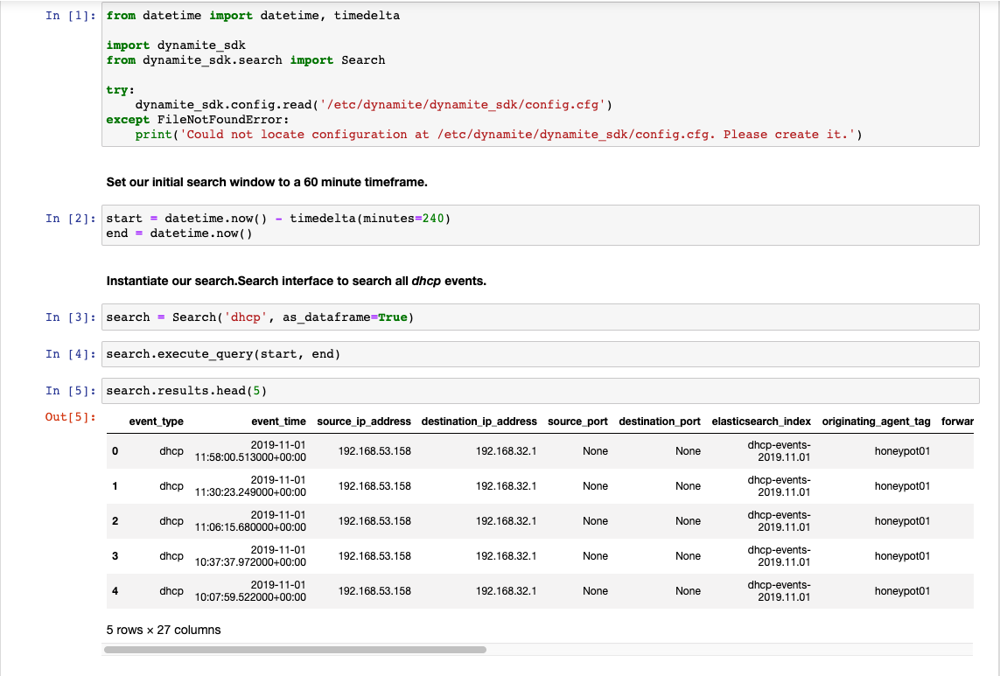

# Dynamite Lab <sub>Experimental</sub>



DynamiteLab provides the ability to work directly with your network data through a simple Python SDK. The lab has two major components:

- JupyterHub which provides an environment for creating new notebooks.
- DynamiteSDK which allows you to easily retrieve events ElasticSearch as `pandas.Dataframes.`

### Installation

It is recommended that you install the lab environment on the same machine as ElasticSearch. This reduces latency, resulting in faster query time.

`dynamite lab install`

If you choose to install on an instance that doesn't also host ElasticSearch, you will need to specify the `--es-host`.

`dynamite lab install --es-host $ES_HOST`

### Configuration

DynamiteLab relies on a very simple configuration file located in `/etc/dynamite/dynamite_sdk/config.cfg`. It has the following configuration options:

```
[AUTHENTICATION]
elasticsearch_url = http://localhost:9200
elasticsearch_user = elastic
elasticsearch_password = changeme

[SEARCH]
timeout = 60
max_results = 20000
```

#### Authentication
- *elasticsearch_url*: The full URL string to the ElasticSearch instance.
- *elasticsearch_user*: The user, used to login to ElasticSearch; DynamiteNSM automatically sets up the `elastic` user for this purpose.
- *elasticsearch_password*: The password for the given user.

#### Search
- *timeout*: The max number of seconds to wait for a query to complete before cutting it short. 
- *max_results*: The max number of results to return in a single `pandas.Dataframe` (or `results` array).

### First Usage
Once installed DynamiteLab can be started with the following command:

`dynamite lab start`

Ensure that it is running and configured properly.

`dynamite lab status`

If it is, the lab will now be accessible at `127.0.0.1:8000`. You should be able to login with the `jupyter` user and the password you defined during installation.

### SDK Documentation
The SDK is documented in detail [here](https://dynamite-sdk-lite.s3-us-west-2.amazonaws.com/index.html).

### Troubleshooting

#### JupyterHub fails to start.
A botched JupyterHub installation will prevent the lab from starting properly. 

1. Check that you can run `jupyterhub -h` from a shell with root access. If you cannot, install JupyterHub manually.
2. Try restarting your shell (logout/login) or "re-source" your environment variables.

#### JupyterHub is started, but I can't access the environment at the lab provided.

1. Check to see if you have a local firewall enabled such as:
  - firewalld
  - IPTables
  - UFW

#### My DynamiteSDK is failing to import.

1. Check to see if the SDK is installed in a globally accessible path such as: `/usr/lib/python3.6/dist-packages/dynamite_sdk_lite-0.1-py3.6.egg`. Run through the installation process described [here](https://github.com/DynamiteAI/dynamite-sdk-lite).

2. Check that all dependency libraries installed successfully. If not, attempt to install them manually.
```
pip3 install pandas
pip3 install python-dateutil
pip3 install elasticsearch
```

#### My DynamiteSDK is failing to authenticate.

1. Check that your configuration is available at `/etc/dynamite/dynamite_sdk/config.cfg` and readable by the `jupyter` user.

2. Check for typos in the `elasticsearch_user` and `elasticsearch_password`.

3. Can you curl ElasticSearch?
```
curl -u username:password http://my-elasticsearch-host:9200
```