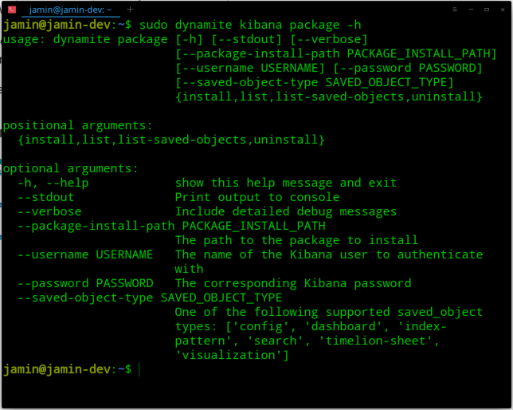
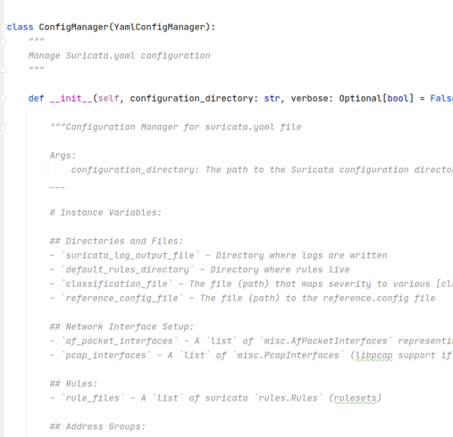
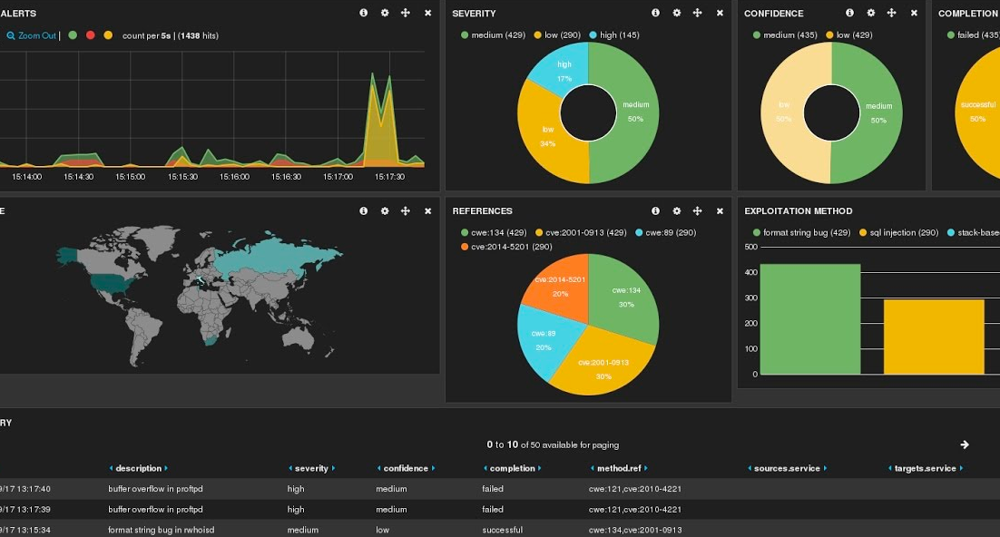
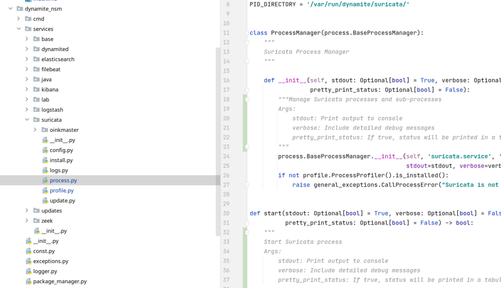

## Welcome to the Software Developer Documentation.
We're glad you're here. This documentation is targeted a developers who wish to contribute directly to the DynamiteNSM modules.

Below you can find documentation to get you started down a development track.

### Creating a new command-line module.

DynamiteNSM provides a powerful set of SDKs for creating installable, configurable, and *moniterable* `services` that can be converted directly into command-line utilities with very little code.

[Read the docs »](cmd_module/)

### Extend a configuration wrapper

DynamiteNSM provides configuration wrappers for the majority of the available `services` modules. Each `ConfigManager` classes are easily extended to support new options. 

[Read the docs »](config_extend/)

### Build a Kibana Package
DynamiteNSM provides a simple package manager for creating and managing packages. Create an awesome set of dashboards and visualisations built for your use-case.

[Read the docs »](kibana_package/)

### Dive into the SDK Documentation

Check out our SDK documentation to learn about the different libraries available to you.

[Read the docs »](SDK/logger.py)
