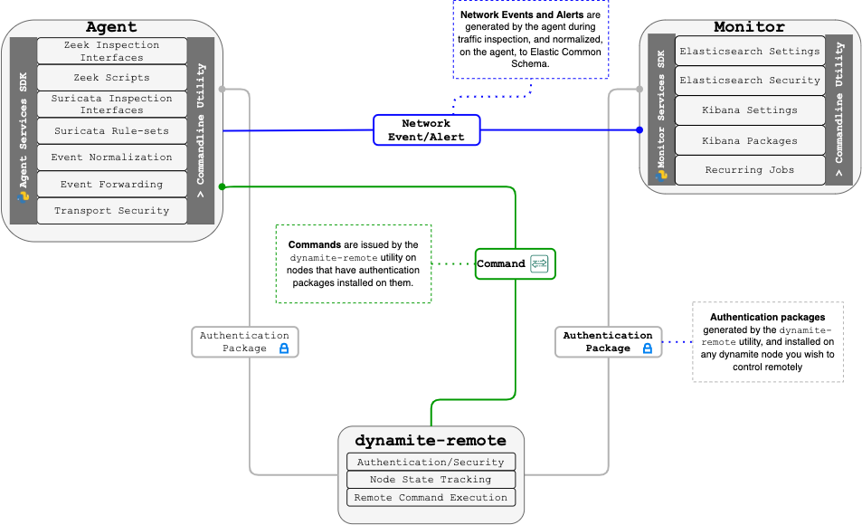

# Dynamite Remote
The `dynamite-remote` utility is a self-contained script that ships with the `dynamite-nsm` package. The utility
allows administrators to create *Authentication packages* that once installed on remote instances allow remote management. 
The dynamite-remote script works on most *NIX operating systems with `openssh-client` installed.

## Usage

The `dynamite-remote` utility should be run on the machine you wish to use for remote management. 
Once an authentication package has been created you can [install it](/services/10_auth) on a remote node to easily manage it.



```
$ dynamite-remote -h

usage: Dynamite Remote [-h] {create,remove,list,execute} ...

Remotely manage DynamiteNSM nodes across your network environments.

positional arguments:
  {create,remove,list,execute}
    create              Generate an authentication package that can be
                        installed on a remote node allowing management. Add
                        the remote to list of controllable nodes.
    remove              Remove a remote that was previously created.
    list                List the nodes we can control remotely.
    execute             Run a command against a remote node.

optional arguments:
  -h, --help            show this help message and exit

```
## Create Remote Authentication Package

```
$ dynamite-remote create -h

usage: Dynamite Remote create [-h] --name NAME --host HOST [--port PORT] [--description DESCRIPTION]

optional arguments:
  -h, --help            show this help message and exit
  --name NAME           A friendly name for the remote node.
  --host HOST           A host or IP address of the remote node you will be connecting to.
  --port PORT           The corresponding SSH port to use.
  --description DESCRIPTION
                        A description of this node (E.G web-server environment sensor)

```
## Execute on Remote

```
$ dynamite-remote execute -h

usage: Dynamite Remote execute [-h] remote command [command ...]

positional arguments:
  remote      The name of the node or node group to execute the command against.
  command     The command to run on the remote node (E.G 'elasticsearch process status').

optional arguments:
  -h, --help  show this help message and exit

```

## Remove Remote

```
$ dynamite-remote remove -h

usage: Dynamite Remote remove [-h] remote

positional arguments:
  remote      The name of the node or node group to remove.

optional arguments:
  -h, --help  show this help message and exit
```

