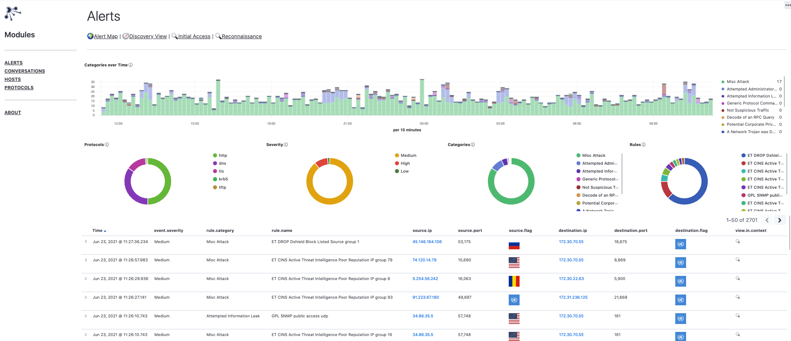
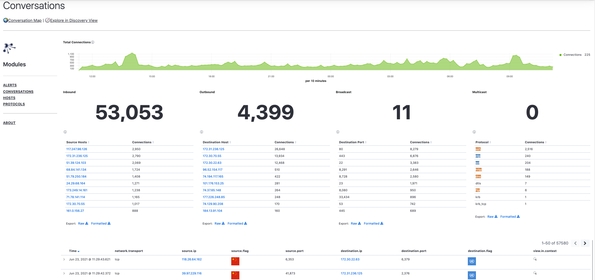
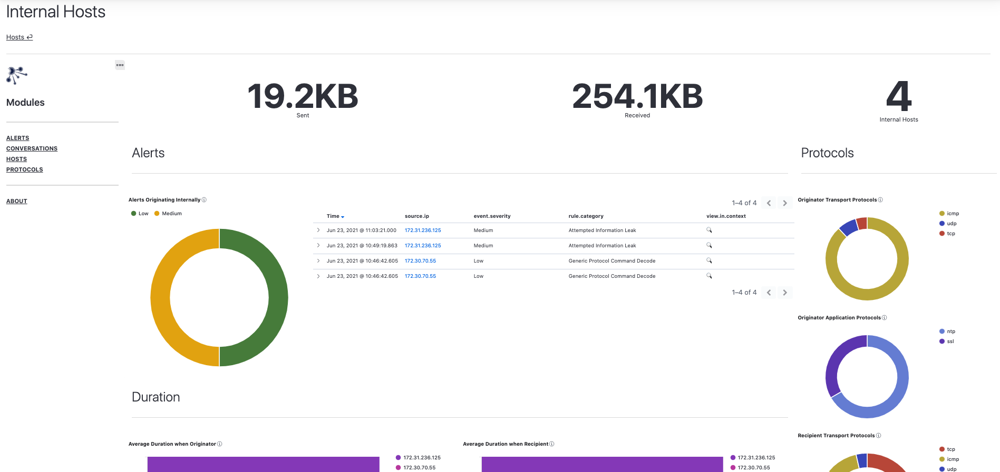
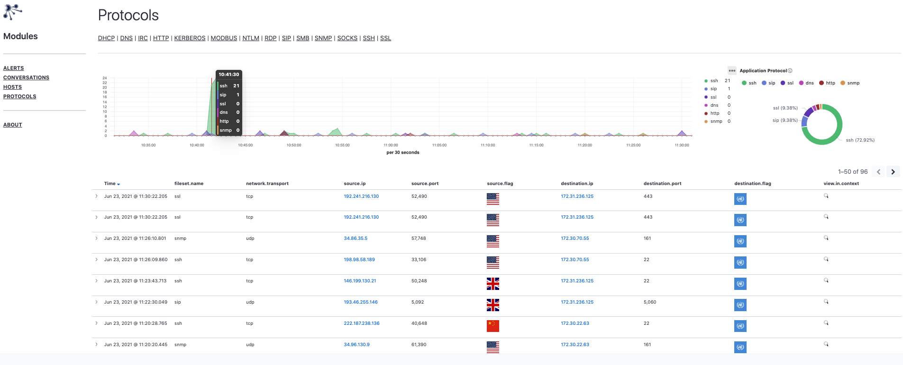

# Overview

**By default**, DynamiteNSM ships with a powerful analytics package containing dashboards and visualizations, purpose built for a variety 
of operational and detection use-cases. 

## Modules

Within the `BaseViews` Kibana package, `modules` designate a collection of views built around a specific sub-set of filters.

These filters slice Dynamite's [ECS based](../../../about/data_model/01_overview) data into four categories: alerts, events, hosts, and protocols. 

Each module provides a unique perspective into one of these categories. To view a specific module, click the module name in the left pane of the view.  Module views are structured in a standard way where you'll find links to additional views within the module at the very top of the page, directly below the view title.  

Below that you'll find histograms and other visualizations that illuminate porportions of different categorical values in the data set.  Visualizations are interactive, and by clicking on a value you can quickly include or exclude the value from the filter in use by the view.  After you've explored the view's visualizations, use the data table at the bottom for more detailed analysis and to access pivots to other relevant views.  

### Alerts

Alerts are typically indicative of suspicious or malicious behavior. The Alerts module provides different perspectives that make investigating this suspicious traffic, simple and efficient.      

> ⓘ You can always [adjust](../../../configuration/agent/03_scripts_and_rules#suricata) the kinds of alerts that get triggered through the dynamite commandline utility.

    

### Conversations

Conversations represent bidirectional communications between hosts. The Conversations module provides  high-level summaries of top-talkers, ports, and application
protocols and can serve as a starting point for more focused threat hunts.

    

### Hosts

The Hosts module contains views that provide metrics from the perspective of internal and external hosts.  This is a host-centric take on analyzing network traffic and allows you to quickly identify specific hosts that can serve as the focal point of your analysis efforts.

    

### Protocols

The Protocols module primarily focuses on common application layer protocols. Views in this module function as a launch point into other protocol specific views.

> ⓘ You can always [adjust](../../../configuration/agent/03_scripts_and_rules#zeek) the kinds of protocols that get analyzed through the dynamite commandline utility.

    

