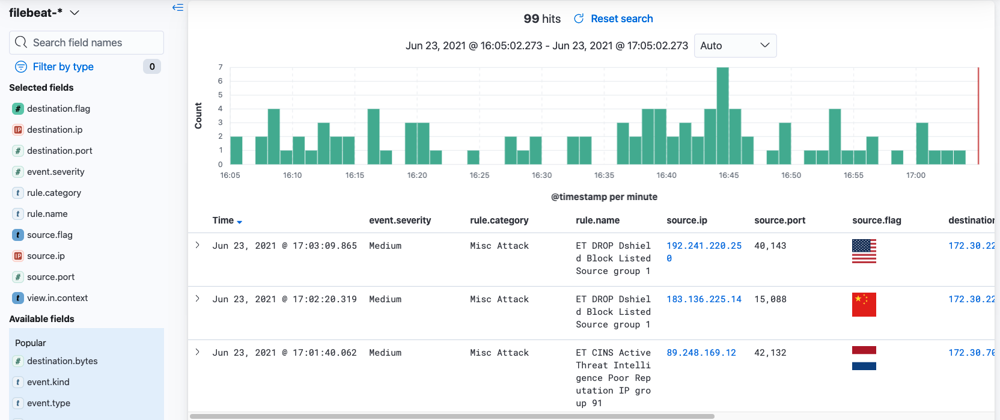

# Alerts Module

The Alerts Module is tailored to the analysis of Suricata alerts.  The primary view contains a histogram that provides a breakdown of alert volume by category.  Below you'll find categorical visualizations that provide different vantage points into notable alert attributes.  Click on a value in the legend to add/remove specific values from the view filter.

## Alert Map

The `Alert Map` view provides a world map showing the volume of alerts (represented as a color) generated by countries around the world.  Alerts shown in this view originated externally, that is outside of the monitored network environment.  While exploring the world map, click on a particular country to add it to the view filter.  The list of alerts shown in the data table will be updated allowing you to quickly triage the alerts source from the selected country.  

    

## Discovery View

The `Discovery View` in the Alerts module provides a list of raw alerts in a customized data table.  This view provides an easy-to-digest list of alerts that can be explored using the search bar and filters.  Most commonly, the discovery view is used when you want to search for alerts of a particular type or to/from a particular host.  This view is also great for refining queries and filters and turning them into custom visualizations.   

    

## Initial Access

The `Initial Access` view shows a pre-filtered list of alerts that align to MITRE ATT&CK's Initial Access tactic category.  This primarily includes alerts related to exploitation attempts or attempted authentication using default or guessed credentials.  

    

## Reconnaissance

The `Reconnaissance` view shows a pre-filtered list of alerts that align to MITRE ATT&CK's Reconnaissance tactic category.  This primarily includes alerts related to active scanning or probing of accessible hosts and services.  

    

