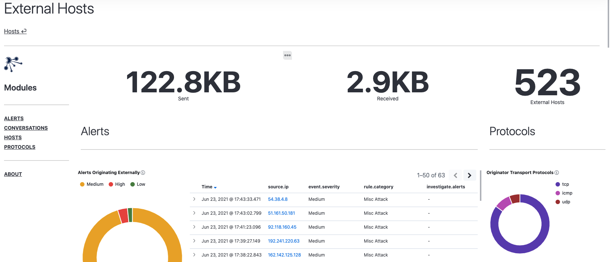

# Hosts Module

The Hosts module contains views that provide metrics from the perspective of internal and external hosts.  The primary view includes several metrics that describe the number of internal vs external hosts observed as well as the traffic volume sent and received from each.  

## Internal Hosts

The `Internal Hosts` view includes a summary of conversations from the perspective of internal, or protected, hosts.  At the top of the page you'll find a summary of data transfer in both the inbound and outbound directions. It also includes a list of alerts generated by internal hosts as well as a breakdown of transport protocols in use.  Further down the page, you'll find visualizations and tables that identify notable internal hosts based on the average duration and bytes sent/received during relevant conversations.

    

## External Hosts

The `External Hosts` view presents a summary of conversations and alerts from the perspective of external, or unknown hosts. It includes summary metrics of data transfer, a list of alerts generated by external hosts as well as a breakdown of transport protocols in use.  Further down the page, you'll find visualizations and tables that identify notable external hosts based on the average duration and bytes sent/received during relevant conversations.

    

