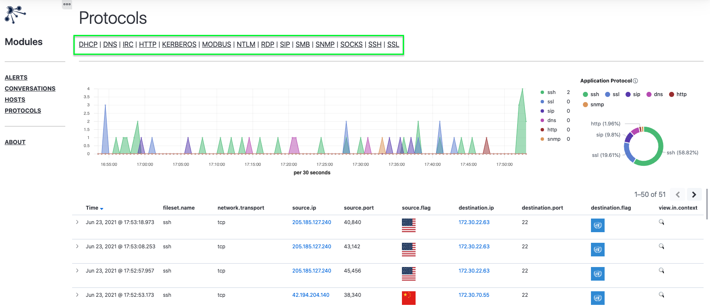

# Protocols Module

The Protocols module provides views geared toward the analysis of common application layer protocol usage. Views in this module function are meant to seed threat hunting efforts and drive investigative workflows that are not dependant on IDS alerts.

The primary view includes a histogram showing protocol activity over time as well as a donut visualization representing the volume of connections by protocol.  Each of these visualizations is interactive and can be used to adjust the time frame and protocol field filters respectively.  

Using the view navigation menu (highlighted below) you can quickly access pre-filtered discovery views for exploring communications for a specific protocol. 

    

