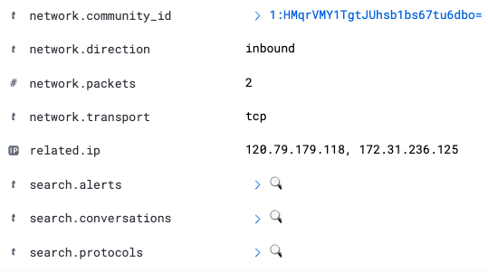
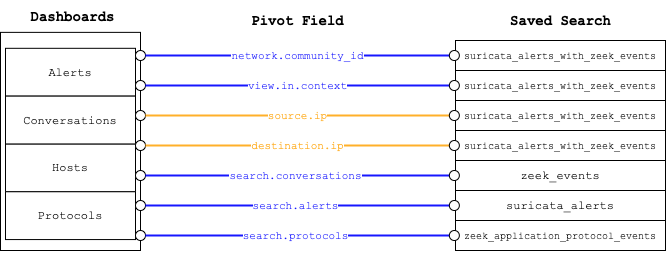

# Pivot Fields
 
Pivot fields are special fields that can be used to dynamically apply specific views and filters.

## Types of Pivot Fields

- **Community Id Pivots** - These pivots rely on a common id that exist within every event and alert generated by the 
  agent. They typically return between 1 and 3.
- **IP Address Pivots** - These pivots work on the `source.ip` and `destination.ip` fields. There is no upper limit to
the number of events that can be returned by this pivot.

