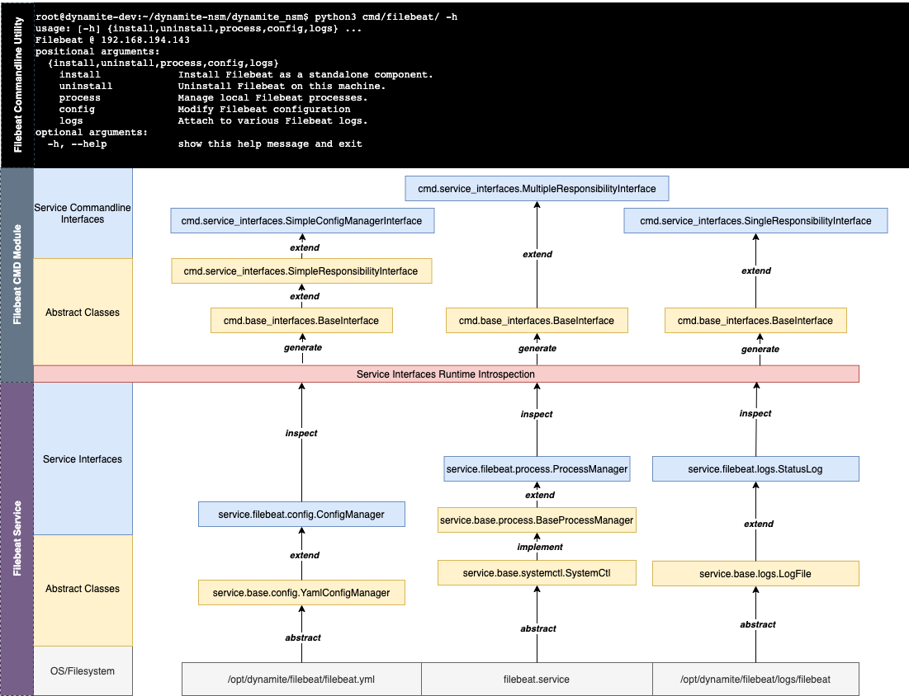

# Build a Commandline Utility

DynamiteNSM `services` SDK provides programmatic access to Zeek, Suricata, Filebeat, Elasticsearch, Logstash, Kibana, 
and several other utilities. DynamiteNSM's `cmd` SDK provides the ability to dynamically generate commandline interfaces
for `service` classes.

## Service Architecture



Services have three primary design principles:

1. Must provide a consistent layer of abstraction above a set of common `actions`. In doing so we maintain 
   *least-surprise* in keeping the development experience relatively consistent across all services.

2. Must be self-contained. Each `service` is a dedicated module with individual `action` sub-modules. 

3. Must expose classes that fit into one of the following paradigms: single-responsibility or multi-responsibility.

## Single Responsibility Class
[cmd.service_interfaces.SingleResponsibilityInterface 🔗](../../../guides/developers/SDK/cmd/service_interfaces#dynamite_nsm.cmd.service_interfaces.SingleResponsibilityInterface)

A class that when instantiated has one primary method that will be called to make things happen. 
This pattern works well with many `service` `InstallManager`.

### Example Class
```python
class InstallManager:
    def __init__(self, install_directory: str):
        """
        Prepare install manager, perhaps profiling the system and determining constraints
        """
    
    def setup(self, cpus: int = 4):
        """
        Perform the actual operations of installing service dependencies,
        and performing some initial configuration.
        """

# Invoking the class
installer = InstallManager('/opt/dynamite/stuff')
installer.setup()
```

## Multiple Responsibility Class
[cmd.service_interfaces.MultipleResponsibilityInterface 🔗](../../../guides/developers/SDK/cmd/service_interfaces#dynamite_nsm.cmd.service_interfaces.MultipleResponsibilityInterface)

A class that when instantiated has multiple methods that can be invoked to perform various actions.
The `ProcessManager` class commonly falls into this pattern.


### Example Class

```python

class ProcessManager:

    def __init__(self, stdout: bool = True):
        """
        Load up process information
        """
    
    def start(self):
        """
        start the loaded process
        """
    
    def stop(self):
        """
        stop the loaded process
        """
    
    def restart(self):
        """
        restart the loaded process
        """

# Invoking the class
proc_man = ProcessManager()
proc_man.start()
proc_man.stop()
proc_man.restart()
```

## Building a Simple Service

We will use the `updates` service to demonstrate how to quickly prototype a `dynamite` cmd utility.
The `updates` service has one primary task. To grab the latest configurations and mirrors for external components.


## The `updates` Service

The `updates` service has one `action` module `install.py`. This class does nothing too complicated, and provides a single
method upon which an interface can be derived.

```python

class InstallManager(install.BaseInstallManager):

    def __init__(self, stdout: Optional[bool] = False, verbose: Optional[bool] = False):
        super().__init__('updates.install', verbose, stdout)
        self.stdout = stdout
        self.verbose = verbose

    @staticmethod
    def update_default_configurations():
        """
        Retrieves the latest skeleton configurations for setting up ElasticSearch, LogStash, Kibana, Zeek, Suricata,
        and Filebeat
        """
        ...

    @staticmethod
    def update_mirrors():
        """
        Retrieves the latest mirrors which contain the download locations for all components
        """
        ...

    def setup(self):
        """
        Download updates and setup them up.
        """
        self.logger.info(
            'Attempting to download the latest mirrors and default configurations for installable components.')
        self.update_mirrors()
        self.update_default_configurations()
        self.logger.info(
            'Updates have been applied. The next time you install: elasticsearch, logstash, kibana, zeek, suricata, '
            'or filebeat these updates will be applied to that component.')
```

## Converting to a Commandline Utility
You should now be able to expose a commandline interface by wrapping the class created above inside a `SingleResponsibilityInterface`
with the following code.

```python
from dynamite_nsm.services.updates import install
from dynamite_nsm.cmd.service_interfaces import SingleResponsibilityInterface

interface = \
    SingleResponsibilityInterface(cls=install.InstallManager,
                                  interface_name='Update DynamiteNSM Default Configs',
                                  interface_description='Update mirrors and default configurations',
                                  entry_method_name='setup',
                                  defaults=dict(stdout=True)
                                  )
if __name__ == '__main__':
    # Get an instance of argparse.ArgumentParser
    parser = interface.get_parser() 
    # Parse out the arguments that have been passed in
    args = parser.parse_args()
    # Call the execute method against the parsed args
    interface.execute(args)
```

Calling this utility from the commandline will result in the following:

```bash
Update DynamiteNSM Default Configs - Update mirrors and default configurations

optional arguments:
  -h, --help  show this help message and exit
  --stdout    Print output to console
  --verbose   Include detailed debug messages
```


