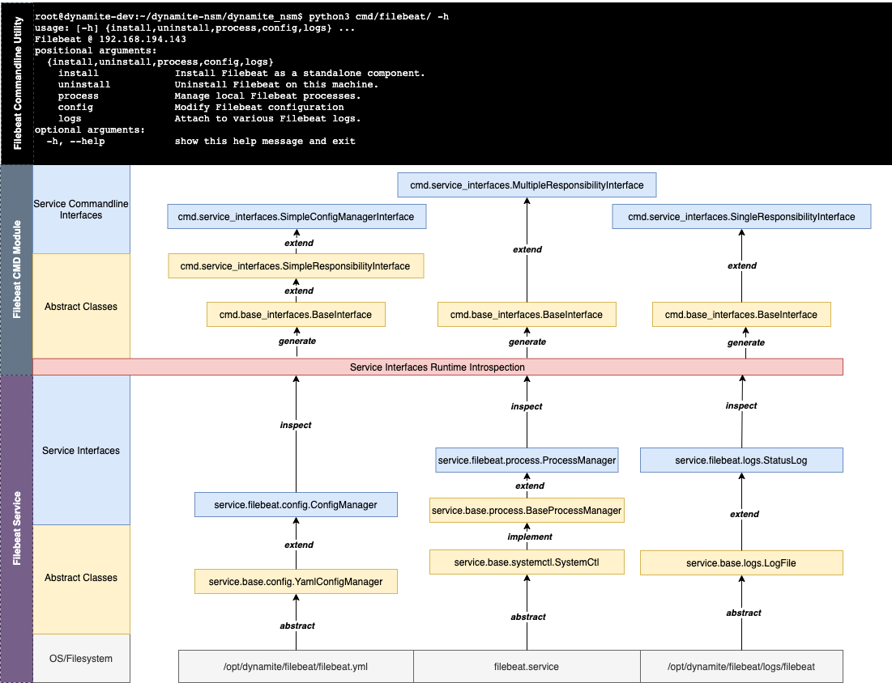

# SDK Overview


## Highlevel Design Concepts

### Services and Actions
DynamiteNSM SDK is organized around the concept of `services` and `actions`.

Put simply, within our system of nomenclature a `service` is a module that exposes a set of `actions`. 
Actions are applied against a service and usually result in some state change. The implementation of this principle within
the SDK is demonstrated below: Each `service` module contains a set of `action` modules.

```text
[+] ├─ dynamite_nsm/ 
[-]  ├─ cmd/
[+]  ├─ services/
[+]     ├─ zeek/
         ├─ install.py
         ├─ logs.py
         ├─ uninstall.py
         ├─ config.py
         ├─ process.py
         ├─ profile.py
[-]     ├─ suricata/
[-]     ├─ filebeat/
[-]     ├─ elasticsearch/
[-]     ├─ logstash/
[-]     ├─ kibana/
[-]     ├─ base/
     ├─ const.py
     ├─ exceptions.py
     ├─ logger.py
     ├─ package_manager.py
     ├─ utilities.py
```

The `base` service contains a set of useful actions for building new services and extending existing ones.

| Action Module | Description                                                                                                         | Corresponding Base Classes                 |
|---------------|---------------------------------------------------------------------------------------------------------------------|--------------------------------------------|
| install       | An interface to manage the installation of a service.                                                               | `BaseInstallManager`                       |
| uninstall     | An interface to manage the uninstallation of a service.                                                             | `BaseUninstallManager`                     |
| config        | An interface for interacting with various configurations available to the service.                                  | `GenericConfigManager` `YamlConfigManager` |
| logs          | An interface for searching through various logs.                                                                    | `LogFile`                                  |
| process       | An interface for managing process state (`start` `stop` `status` `restart`)                                         | `BaseProcessManager`                       |
| profile       | An interface the provides a set of checks against a service to ensure that it is installed and configured properly. | `BaseProcessProfiler`                      |

### Commandline Builder

DynamiteNSM ships with the `dynamite` commandline utility. This utility is documented in detail [here](/for_security_engineers/commandline_utility).

The `cmd` module comes with a set of sub-modules that can be used to wrap `action` classes and convert them directly into
commandline utilities that are invokable under the `dynamite` utility. 


```text
```text
[+] ├─ dynamite_nsm/ 
[+]  ├─ cmd/
[-]     ├─ zeek/
[-]        ├─ config/
[+]        ├─ install/
              ├─ __main__.py
              ├─ __init__.py
[-]        ├─ logs/
[-]        ├─ process/
[-]        ├─ uninstall/
[-]     ├─ suricata/
[-]     ├─ filebeat/
[-]     ├─ elasticsearch/
[-]     ├─ kibana/
[-]     ├─ logstash/
[-]     ├─ updates/
        ├─ base_interface.py
        ├─ config_object_interfaces.py
        ├─ service_interfaces.py
        ├─ inspection_helpers.py
        ├─ interface_operations.py
```


| CMD SDK Module           | Description                                                                                   |
|--------------------------|-----------------------------------------------------------------------------------------------|
| base_interface           | Abstract base interface implemented by all interface modules                                  |
| service_interfaces       | Provides commandline wrappers for many `service.base` action classes.                         |
| config_object_interfaces | Provides commandline wrappers for complex config objects.                                     |
| inspection_helpers       | Provides a set of utility functions and classes for building commandline parsers dynamically. |
| interface_operations     | Provides a set of utility functions for combining commandline interfaces.                     |


## Example Service Architecture

