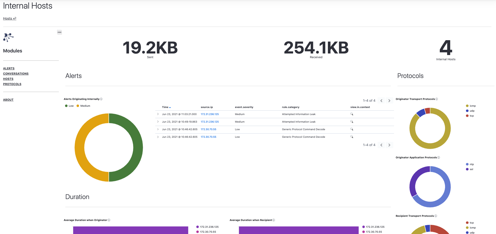
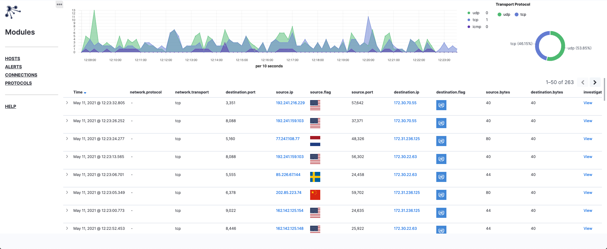
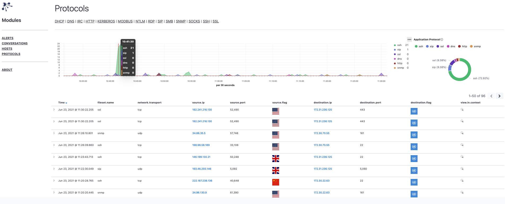

## Description
Installed by default this Kibana package provides several dashboards for discovering suspicious/malicious behaviors on your network.  The dashboards are organized around three primary data-models: alerts, events, and hosts. This package takes advantage of the shared identifiers embedded in generated models to facilitate deep-dives and pivots.

### Hosts
Information from the perspective of hosts on the network.  Events and alerts are aggregated over a `24 hour` time period to record  statistical information for hosts. Host definitions are refreshed `every 10 minutes`.   This dashboard provides the ability to *drilldown* into alerts and connections associated with a host. Hosts within this view can easily be filtered by whether they are internal or external to the monitored network.

### Alerts
Traditional IDS (EmergingThreats) alerts show up here.  This dashboard provides the ability to *pivot* to corresponding connections and underlying protocols.

### Connections
Conversations between hosts show up here. This view is primarily concerned with transport layer details of a connection. Connections can be associated with one or more protocol logs or alerts.  This dashboard provides the ability to *pivot* from a connection into its underlying protocols (if one was detected and parsed).

### Protocols
Application protocol specifics for conversations between hosts. This view is primarily concerned with providing additional details to `connections` where a protocol was detected.
