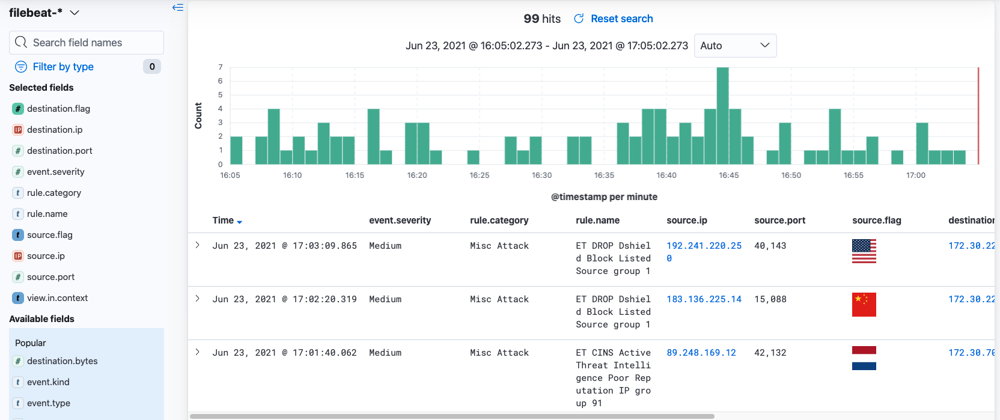
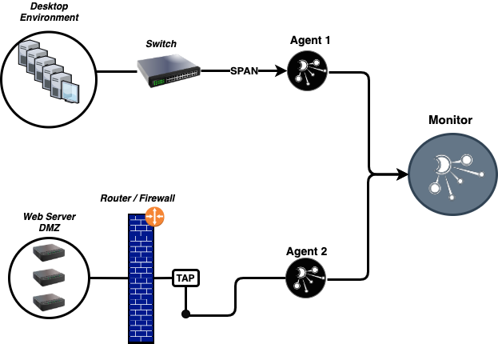

# Introduction

### What is Dynamite Network Security Monitor?

DynamiteNSM is a lightweight network security monitor conveniently bundled as a `Python ≥3.7` package. 
Built initially to simplify the installation of [Zeek](https://zeek.org/) and [Suricata](https://suricata.io/), the package now includes a robust set of Python modules for installing and managing both network monitoring and data visualization services.

However, you do not need to write a single line of code to begin using DynamiteNSM. 
The package comes with a commandline utility that automates the deployment of passive, packet-sniffing `agents` throughout your network, along with a `monitor` for visualizing the events produced by them.

- The **Agent** extracts Zeek network metadata merged with Suricata IDS security alerts and forwards them to a downstream collector. 
- The **Monitor** receives these events, normalizing and indexing them, so that they can be visualized and queried later.

DynamiteNSM can provide insights into a variety of network environments including high-speed data centers, small-to-large enterprises, IoT & industrial networks, and even at home.

    

    <a href="./about/02_architecture"> Read More »</a>

### Checkout the Dashboards

DynamiteNSM ships with a powerful set of visualizations, saved queries, and dashboards purpose built to provide useful analytics
for a variety of operational and security use-cases.

    

    <a href="./guides/base_views/01_overview"> Read More »</a>

### Dive Right In.

Learn by doing. Read our [QuickStart Guide](./guides/01_quick_start), and quickly set up a working environment perfect for 
monitoring a home network or lab environment.

    

    <a href="./requirements/01_supported_operating_systems"> Read More »</a>

### Contribute

Whether you have a cool detection, visualisation, or SDK contribution we welcome collaboration!

    <a href="./guides/developers/01_overview"> Read More »</a>

