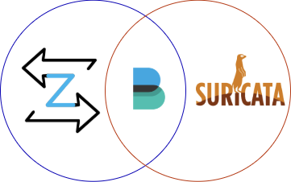

# Install across Separate Instances

> ⚠️ If you ever change the number of CPU cores or inspection interfaces on an agent instance simply run: `dynamite agent optimize --inspect-interfaces <int1f> <intf2>...` to automatically adjust
> CPU-affinity and threading families.

Zeek and Suricata can also be installed independently on their own dedicated instances. However, Filebeat **must**
be installed alongside for logs to be forwarded downstream.

<p align="center">
   
</p>


## Update Default Configs and Mirrors

On each instance make sure you have the latest default configurations and mirrors for the version of DynamiteNSM you have installed.
```bash
sudo dynamite updates install
```

## Dedicated Zeek Instance

### Install Zeek Service

Install Zeek configured to monitor several inspection interfaces. In the below example traffic on the interfaces 
`eth0` `eth1` and `eth3` will be monitored.

```bash
sudo dynamite zeek install --inspect-interfaces eth0 eth1 eth2
```

### Install Filebeat Service
Next, install Filebeat which in our below example will forward the logs on to a Kafka instance at the address `dynamite-broker.local:9092`

```bash
sudo dynamite filebeat install --target-type=kafka --target-strings dynamite-broker.local:9092
```

### Configure Filebeat Service

Let's say our Kafka instance requires authentication and of course we need to specify a topic. We don't handle this at initial install time,
instead, once installation is complete you can set a password via `dynamite filebeat config` command.

```bash
sudo dynamite filebeat config main kafka_targets --username admin --password admin --topic events
```
```markdown
╒═════════════════╤═════════╕
│ Config Option   │ Value   │
╞═════════════════╪═════════╡
│ topic           │ events  │
├─────────────────┼─────────┤
│ username        │ admin   │
├─────────────────┼─────────┤
│ password        │ admin   │
╘═════════════════╧═════════╛
```

### Start the Processes

Once installed and configured you can start each process separately or use the `dynamite agent` convenience
service.

```bash
sudo dynamite filebeat process start
sudo dynamite zeek process start
```

## Dedicated Suricata Instance

Install Suricata to install a single inspection interface in the below example traffic on 
`mon0` will be monitored.

### Install Suricata Service

```bash
sudo dynamite suricata install --inspect-interfaces mon0
```

### Install Filebeat Service
Now, install Filebeat which in this example will forward the logs directly to Elasticsearch instance at `https://dynamite-monitor:9200`.

```bash
sudo dynamite filebeat install --target-type=elasticsearch --target-strings https://dynamite-monitor:9200
```

### Configure Filebeat Service

Configure the credentials separately via `dynamite filebeat config`.


```bash
sudo dynamite filebeat config main elasticsearch_targets --username admin --password admin
```

### Start the Processes

Once installed and configured you can start each process separately or use the `dynamite agent` convenience
service.

```bash
sudo dynamite filebeat process start
sudo dynamite suricata process start
```