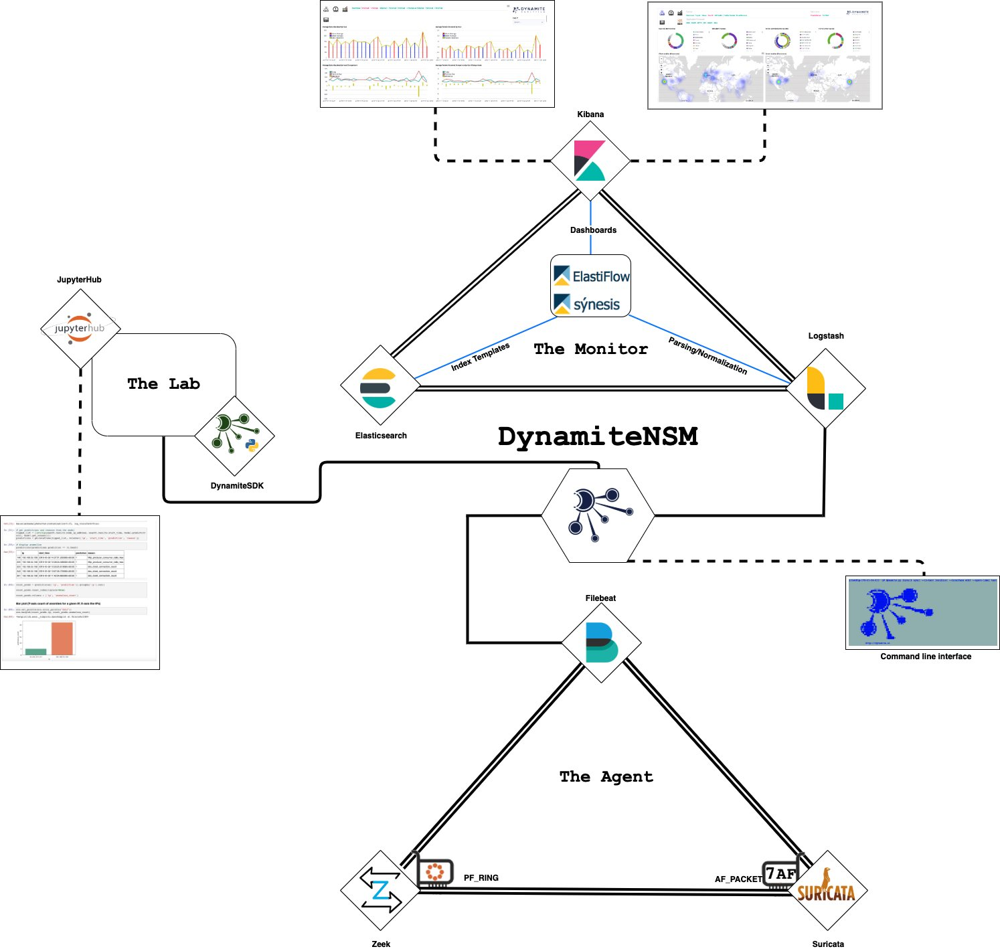

# Components

### The Agent

The agent (sensor) is responsible for generating JSON events from raw network packets and forwarding these events to a monitor. 

| Component   | Description                                                                                                                                                                                                                                                      |
|-------------|------------------------------------------------------------------------------------------------------------------------------------------------------------------------------------------------------------------------------------------------------------------|
| [Zeek [2.6.1]](https://github.com/zeek/zeek)           | Previously Bro, Zeek is a powerful network analysis framework that is differs from your typical IDS. It is capable of enumerating detailed information surrounding network connections and their underlying protocols.|
| [Suricata [4.1.4]](https://github.com/OISF/suricata)   | Suricata is an Intrusion Detection System (IDS), powered by the latest open [EmergingThreat](https://doc.emergingthreats.net/) rule-sets.
| [Oinkmaster [2.0]](http://oinkmaster.sourceforge.net/download.shtml)| A script to automate management of Suricata rule-sets, and keep rules up-to-date.
| [PF_RING [7.4.0]](https://github.com/ntop/PF_RING)     | A new type of network socket that dramatically improves the packet capture speed. It is used in conjunction with the Zeek to improve packet analysis.                                                                 |
| [Filebeat [7.2.0]](https://github.com/elastic/beats)   | A powerful log forwarder, with a built in queue mechanisms, and a pressure sensitive protocol that works in conjunction with LogStash.                                                                                |

### The Monitor

The monitor is responsible for collecting these events, enriching and normalizing them, and presenting them to the end-user through intuitive visualizations and a powerful search user interface.	

| Component                                              | Description                                                                                                                     |
|--------------------------------------------------------|---------------------------------------------------------------------------------------------------------------------------------|
| [Logstash [7.2.0]](https://github.com/elastic/logstash)            | A server-side data processing pipeline that ingests data from a multitude of sources simultaneously, transforms it. |
| [Elasticsearch [7.2.0]](https://github.com/elastic/elasticsearch)  | A distributed, RESTful search and analytics engine.                                                                 |
| [Kibana [7.2.0]](https://github.com/elastic/kibana)                | A web-app that allows you to visualize your Elasticsearch data                                                      |
| [ElastiFlow™ [3.5.0]](https://github.com/robcowart/elastiflow) | Provides network flow (**and now Zeek!**) data collection and visualization.                                            |
| [Synesis [1.1.0]](https://github.com/robcowart/synesis_lite_suricata)| Provides Suricata data normalization and visualization.|

### The Lab [Experimental]

The lab is a whole new way of interacting with your network data. It provides a framework for data scientists and network operators to interact with their data through the DynamiteSDK.

| Component                                                              | Description                                                                                                                                                                                 |
|------------------------------------------------------------------------|---------------------------------------------------------------------------------------------------------------------------------------------------------------------------------------------|
| [JupyterHub [1.1.0]](https://jupyterhub.readthedocs.io/en/stable/)     | JupyterHub is a and Python development environment and interactive sandbox. It supports multiple user sessions and is an excellent way to share algorithms and data exploration techniques. |
| [DynamiteSDK [0.1.2]](https://github.com/DynamiteAI/dynamite-sdk-lite) | Provides a set of modules and functions for working with events stored within the Dynamite Network Monitor.                                                                                 |