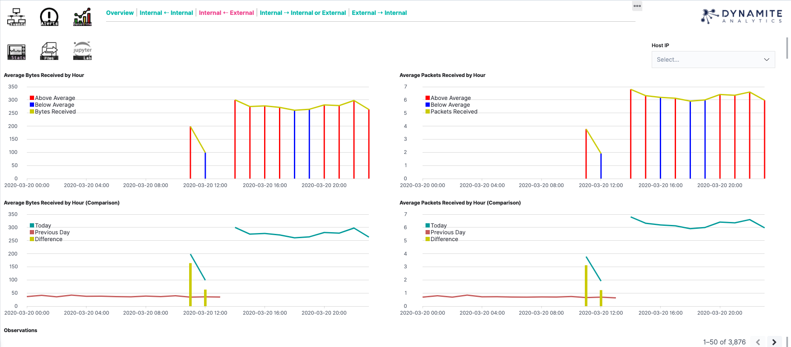

# Baseline Dashboards Experimental

These dashboards are generated using events generated by [Netbase](https://github.com/DynamiteAI/netbase) Zeek scripts. The purpose of these views is to highlight what is normal vs. anomalous traffic for internal assets. These dashboards are organized by directionality, and work best over 24-hour time-windows.

- Internal ⇠ Internal - Traffic being sent from one internal host to another from the perspective of the recipient host.
- Internal ⇠ External - Traffic being sent from an external host to an internal host from the perspective of the recipient host.
- Internal ⇢ Internal or External - Traffic being sent from an internal host to either an internal or external host from the perspective of the originator host.
- External ⇢ Internal Traffic being sent from an external host to an internal host from the perspective of the originator host.
