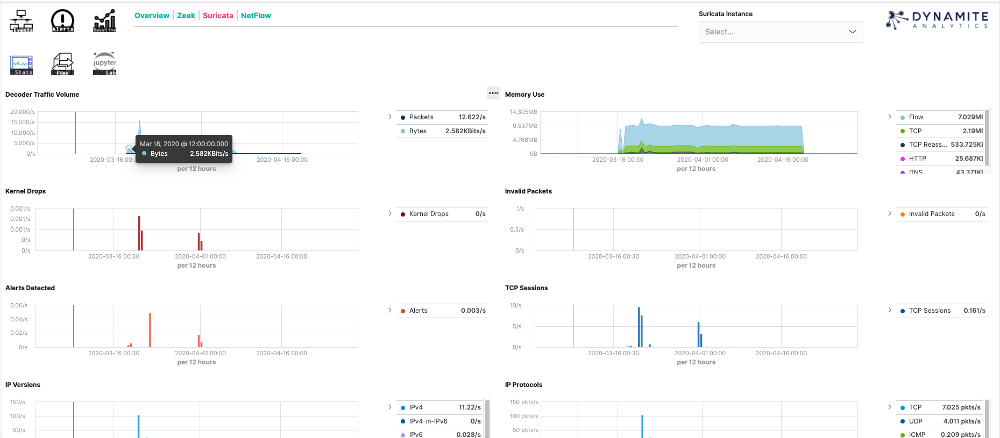

The statistics dashboards are useful for keeping track of the sensors you have deployed throughout your environment. 

It tracks information such as:

- The number of agent instances deployed in your environment.
- Packets/Bytes processed broken down by analyzer (Zeek/Suricata)
- Average Memory Consumption
- Alerts generated